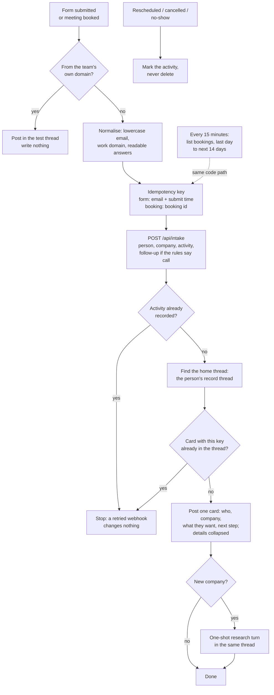

# Website forms and booking pages: one customer, one thread.

Rendered: `forms-and-booking.png`. Paste the block below into any Mermaid viewer, or into a Kylon message, to edit it.

```mermaid
flowchart TB
  A["Form submitted<br/>or meeting booked"] --> B{"From the team's<br/>own domain?"}
  B -- yes --> T["Post in the test thread<br/>write nothing"]
  B -- no --> C["Normalise: lowercase email,<br/>work domain, readable answers"]
  C --> K["Idempotency key<br/>form: email + submit time<br/>booking: booking id"]
  K --> D["POST /api/intake<br/>person, company, activity,<br/>follow-up if the rules say call"]
  D --> E{"Activity already<br/>recorded?"}
  E -- yes --> X["Stop: a retried webhook<br/>changes nothing"]
  E -- no --> F["Find the home thread:<br/>the person's record thread"]
  F --> G{"Card with this key<br/>already in the thread?"}
  G -- yes --> X
  G -- no --> H["Post one card: who, company,<br/>what they want, next step;<br/>details collapsed"]
  H --> I{"New company?"}
  I -- yes --> J["One-shot research turn<br/>in the same thread"]
  I -- no --> Z["Done"]
  J --> Z
  S["Every 15 minutes:<br/>list bookings, last day<br/>to next 14 days"] -. same code path .-> K
  R["Rescheduled / cancelled /<br/>no-show"] --> U["Mark the activity,<br/>never delete"]
```
