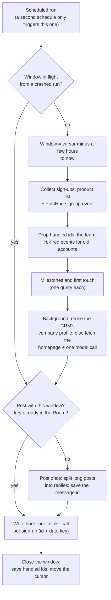

# Daily sign-up digest: one post, one CRM write-back, never twice.

Rendered: `signup-digest.png`. Paste the block below into any Mermaid viewer, or into a Kylon message, to edit it.

```mermaid
flowchart TB
  A["Scheduled run<br/>(a second schedule only triggers this one)"] --> B{"Window in flight<br/>from a crashed run?"}
  B -- yes --> P
  B -- no --> C["Window = cursor minus a few hours<br/>to now"]
  C --> D["Collect sign-ups: product list<br/>+ PostHog sign-up event"]
  D --> E["Drop handled ids, the team,<br/>re-fired events for old accounts"]
  E --> F["Milestones and first touch<br/>(one query each)"]
  F --> G["Background: reuse the CRM's<br/>company profile, else fetch the<br/>homepage + one model call"]
  G --> P{"Post with this window's<br/>key already in the Room?"}
  P -- yes --> W
  P -- no --> Q["Post once; split long posts<br/>into replies; save the message id"]
  Q --> W["Write back: one intake call<br/>per sign-up (id + date key)"]
  W --> Z["Close the window:<br/>save handled ids, move the cursor"]
```
